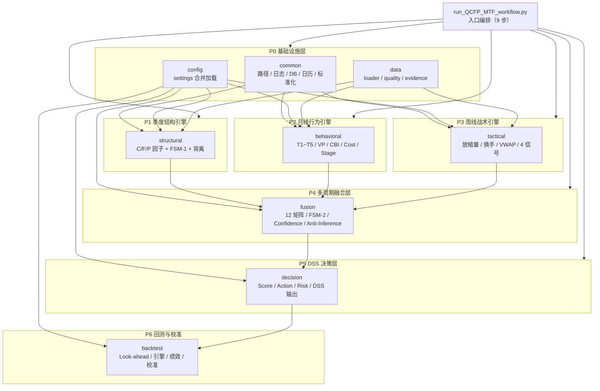
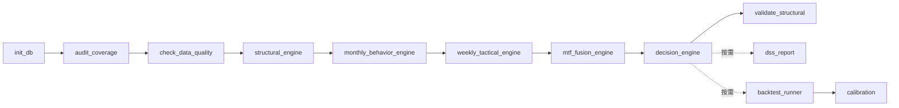
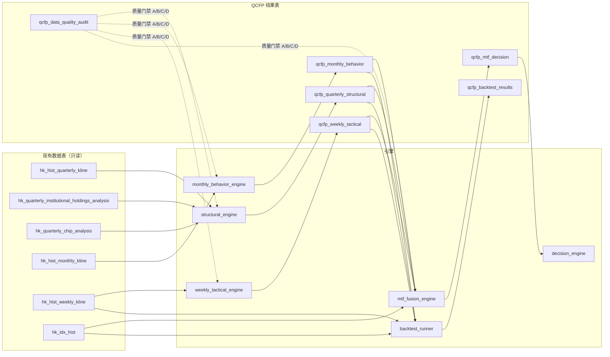
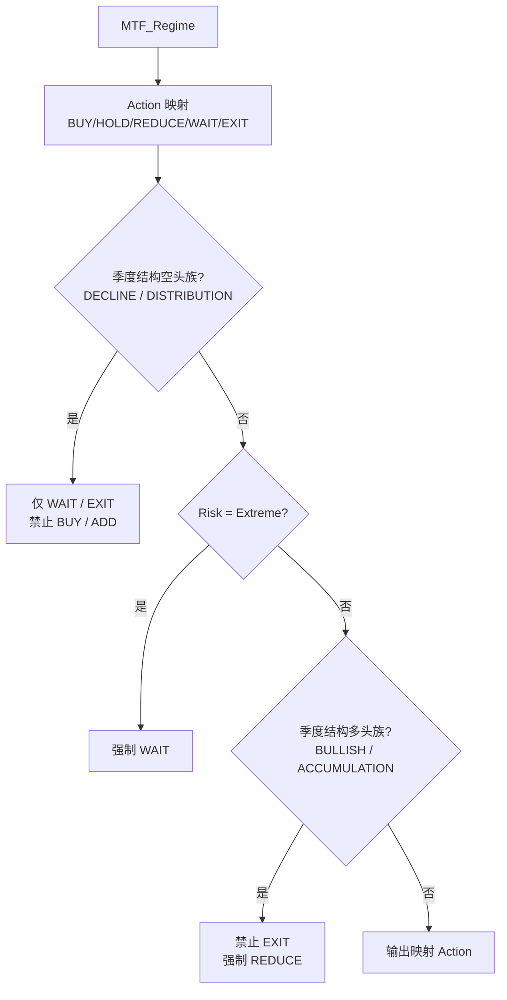

# 列出路径结构及全部模块清单。
以下是 QCFP-MTF 2.1.1 系统的完整路径结构与模块清单（已与磁盘实际文件核对）。

## 一、目录结构

```text
TA_Workflow/
├── run_QCFP_MTF_workflow.py              # 入口编排（9 步数据/引擎流水线）
├── Core/QCFP_MTF/                        # 系统根包（Python 包，需把 Core 加入 sys.path）
│   ├── __init__.py                       # 版本常量 MODEL_VERSION=QCFP-MTF-2.1.1
│   ├── common/                           # 共享工具层（P0）
│   ├── config/                           # 配置加载（P0）
│   ├── data/                             # 数据层（P0）
│   ├── structural/                       # 季度结构引擎（P1）
│   ├── behavioral/                       # 月线行为引擎（P2）
│   ├── tactical/                         # 周线战术引擎（P3）
│   ├── fusion/                           # 多周期融合层（P4）
│   ├── decision/                         # DSS 决策层（P5）
│   ├── backtest/                         # 回测与校准（P6）
│   ├── scripts/                          # 可执行步骤脚本（10 个）
│   ├── sql/create_qcfp_tables.sql        # 建表脚本（6 张表）
│   ├── tests/                            # 单元/集成测试（146 项）
│   └── README.md
├── Config/
│   ├── qcfp_settings.yaml                # QCFP 主配置
│   ├── stock_data_analysis.par           # 含 [QCFP_MTF] 节
│   └── qcfp_*_dictionary.{json,md,xlsx}  # 6 张表 × 3 格式数据字典
├── Code_utl/Generate_qcfp_Dictionaries.py  # 字典生成器
├── Doc/QCFP-MTF_P{0..6}_{开发计划,测试清单,使用手册}.md  # 21 份阶段文档
├── Report/QCFP_MTF/{audit,structural,monthly,weekly,fusion,dss,backtest}/  # 输出产物
├── Log/                                  # 各脚本日志
└── SQLiteDB/HK_Stock.db                  # 数据仓库（6 张 qcfp_* 结果表）
```

## 二、模块清单（按包）

| 包 | 模块 | 职责 |
| :-- | :-- | :-- |
| **common** | `paths.py` | 项目根目录/DB/报告路径解析 |
| | `config_par.py` | 读取 `stock_data_analysis.par`（含 [QCFP_MTF] 节） |
| | `logger.py` | 文件+控制台双输出日志 |
| | `db.py` | SQLite 连接、SQL 文件执行、表结构迁移 |
| | `calendar.py` | 港股交易日历 + 周/月/季切分对齐 |
| | `normalization.py` | Winsorize / Z-Score / 0~100 缩放 / 滚动 Z / 滚动百分位 |
| **config** | `settings.py` | 默认值 + YAML + par 合并加载（含无 PyYAML 兜底） |
| **data** | `loader.py` | 10 张源表 + 2 张派生表标准化加载 |
| | `quality.py` | A/B/C/D 数据质量分级 + 最新审计标签 |
| | `evidence.py` | A/A-/B/C/D 证据等级标注 |
| **structural** | `chip_factors.py` | C 因子（机构持股环比、公司行为屏蔽） |
| | `flow_factors.py` | F 因子（滚动 Z、IFA 横截面 Z、F_UNKNOWN） |
| | `price_factors.py` | P 因子（收益、Trend Score、52W 位置） |
| | `structural_regime.py` | FSM-1 六状态 + Core Score + 保持策略 |
| | `divergence.py` | CPD/FPD/CFD 三维背离 |
| **behavioral** | `turnover_factors.py` | T1~T5 换手-流动性状态 |
| | `volume_factors.py` | 量比、3 期加速度、量/换手方向 |
| | `vp_matrix.py` | 9 种量价结构 + VP_NEUTRAL |
| | `cbi.py` | CBI（Winsorize→Z→0~100→加权） |
| | `cost_position.py` | 周/月/季 VWAP 成本位置 |
| | `monthly_stage.py` | Improving/Stable/Deteriorating |
| **tactical** | `weekly_volume.py` | 放量（>MA20×1.8）/缩量（<0.5） |
| | `weekly_turnover.py` | 季度周均偏离、极端换手（MA8×2） |
| | `weekly_vwap.py` | 周 VWAP 偏离 |
| | `weekly_signal.py` | 均线斜率 + 突破/破位三确认 + 4 信号 |
| **fusion** | `chip_confidence.py` | Chip Stability Confidence（60/40 可配置） |
| | `mtf_alignment.py` | 12 条矩阵 + 兜底 + 不越权断言 + 结构-行为背离 |
| | `mtf_fsm.py` | FSM-2 状态转换 |
| | `anti_inference.py` | 13 条禁止推断规则（warn/replace） |
| **decision** | `score_calculator.py` | State-First 评分 |
| | `action_generator.py` | BUY/ADD/HOLD/REDUCE/EXIT/WAIT 单向门控 |
| | `risk_evaluator.py` | Low/Medium/High/Extreme |
| | `dss_output.py` | 规格书第七章标准 JSON |
| **backtest** | `lookahead_filter.py` | available_date 防 Look-ahead |
| | `data_pipeline.py` | 防 Look-ahead 信号时间线 |
| | `engine.py` | 向量化回测（仓位次周生效） |
| | `cost_model.py` | 港股费率（0.45% 单边） |
| | `performance.py` | 年化/夏普/回撤/胜率/盈亏比/分年度 |
| | `robustness.py` | risk_on/neutral/risk_off 分层 |
| | `cross_validation.py` | 扩展窗口交叉验证 |
| | `calibration.py` | 网格参数校准 |

## 三、脚本清单（scripts/，10 个）

| 脚本 | 阶段 | 用途 | 是否入工作流 |
| :-- | :-- | :-- | :-- |
| `init_db.py` | P0 | 建表 + 迁移 | ✅ 第 1 步 |
| `audit_coverage.py` | P0 | 数据覆盖度审计 | ✅ 第 2 步 |
| `check_data_quality.py` | P0 | A/B/C/D 质量检测 | ✅ 第 3 步 |
| `structural_engine.py` | P1 | 季度结构引擎 | ✅ 第 4 步 |
| `monthly_behavior_engine.py` | P2 | 月线行为引擎 | ✅ 第 5 步 |
| `weekly_tactical_engine.py` | P3 | 周线战术引擎 | ✅ 第 6 步 |
| `mtf_fusion_engine.py` | P4 | 多周期融合 | ✅ 第 7 步 |
| `decision_engine.py` | P5 | DSS 决策回写 | ✅ 第 8 步 |
| `validate_structural.py` | P1 | 结构交叉验证 | ✅ 第 9 步 |
| `backtest_runner.py` | P6 | 全量回测（写库） | ❌ 按需 |
| `calibration.py` | P6 | 参数网格校准 | ❌ 按需 |
| `dss_report.py` | P5 | 个股 DSS JSON/MD 报告 | ❌ 按需 |

## 四、测试清单（tests/，146 项）

- 基础：`test_calendar / test_normalization / test_settings / test_evidence / test_loader / test_quality`（40 项）
- P1 `test_structural/`：chip/flow/price_factors、regime、divergence、engine_smoke（20 项）
- P2 `test_behavioral/`：turnover/volume/vp_matrix/cbi/cost_position/monthly_stage/engine_smoke（21 项）
- P3 `test_tactical/`：weekly_volume/turnover/vwap/signal/engine_smoke（16 项）
- P4 `test_fusion/`：chip_confidence/mtf_alignment/mtf_fsm/anti_inference/engine_smoke（21 项）
- P5 `test_decision/`：score/action/risk/dss_output/engine_smoke（15 项）
- P6 `test_backtest/`：lookahead/data_pipeline/engine/performance/calibration/engine_smoke（13 项）
- 统一入口：`run_all_tests.py`（无需 pytest，兼容 pytest）

## 五、数据库表（SQLiteDB/HK_Stock.db，6 张 qcfp_* 表）

| 表 | 行数 | 说明 |
| :-- | :-- | :-- |
| `qcfp_quarterly_structural` | 944 | P1 季度结构（FSM-1 + Core Score） |
| `qcfp_monthly_behavior` | 2,267 | P2 月线行为（T/VP/CBI/Cost/Stage） |
| `qcfp_weekly_tactical` | 9,827 | P3 周线战术（4 信号） |
| `qcfp_mtf_decision` | 9,827 | P4+P5 融合决策（MTF/Action/Risk） |
| `qcfp_backtest_results` | 4,321 | P6 回测结果 |
| `qcfp_data_quality_audit` | 965 | P0 质量审计快照（保留历史） |

## 六、配置与文档

- **配置**：`Config/qcfp_settings.yaml`（9 大节：model/data_quality/institutional/cbi_weights/chip_confidence_weights/thresholds/structural/behavioral/tactical/fusion/decision/backtest）+ `stock_data_analysis.par [QCFP_MTF]` 节 + 18 个数据字典文件
- **文档**：主计划 1 份 + 每阶段 3 份（开发计划/测试清单/使用手册）共 22 份 + 架构设计 2 份

如需，我可以把这份清单固化成 `Doc/QCFP-MTF_模块清单.md` 方便以后维护时对照。

# 文件长度
QCFP-MTF 系统代码统计如下：

| 类别 | 文件数 | 行数 |
| :-- | :-- | :-- |
| 源码（`Core/QCFP_MTF` 业务模块 + 脚本，含 `__init__.py`） | 64 | 4,187 |
| 单元/集成测试（`tests/`） | 48 | 1,801 |
| 入口编排 `run_QCFP_MTF_workflow.py` | 1 | 118 |
| 字典生成器 `Generate_qcfp_Dictionaries.py` | 1 | 254 |
| **Python 小计** | **114** | **6,360** |
| 建表 SQL（`create_qcfp_tables.sql`） | 1 | 153 |
| 配置（`qcfp_settings.yaml`） | 1 | 175 |
| **代码 + 配置合计** | **116** | **6,688** |
| 文档（主计划 + P0~P6 各 3 份，共 22 份 Markdown） | 22 | 3,461 |
| **总计** | **138** | **约 10,149** |

口径说明：统计不含 `__pycache__` 缓存、`stock_data_analysis.par`（仅新增一个配置节）和数据字典产物（自动生成的 json/md/xlsx 未计入）。源码/测试占比约 79%（6,360 行 Python），文档占 34%（3,461 行），整体规模与"7 阶段、约 50 人天"的规格书工时估计相匹配。

# 模块结构、流水线、数据流与状态机图
以下是 QCFP-MTF 2.1.1 系统的模块结构、流水线、数据流与状态机图。

**模块结构图（六层 + 共享基础设施）**



**工作流流程图（数据流水线 + 按需分析）**



**数据流图（源表 → 引擎 → 结果表）**



**FSM-1 季度结构状态机（仅季度数据驱动）**

```mermaid
stateDiagram-v2
    [*] --> "STRUCTURAL_ACCUMULATION"
    "STRUCTURAL_ACCUMULATION" --> "STRUCTURAL_BULLISH": C↑ F↑ P↑
    "STRUCTURAL_BULLISH" --> "STRUCTURAL_DISTRIBUTION": C↓ F↓ P↑
    "STRUCTURAL_BULLISH" --> "STRUCTURAL_DIVERGENCE": C↑ F↓ P↑
    "STRUCTURAL_DIVERGENCE" --> "STRUCTURAL_DECLINE": C↓ F↓ P↓
    "STRUCTURAL_DISTRIBUTION" --> "STRUCTURAL_DECLINE": C↓ F↓ P↓
    "STRUCTURAL_DECLINE" --> "STRUCTURAL_ACCUMULATION": C↑ F↑ P→
    "STRUCTURAL_DECLINE" --> "STRUCTURAL_BOTTOM_CANDIDATE": C↓ F↑ P↓
    "STRUCTURAL_BOTTOM_CANDIDATE" --> "STRUCTURAL_BULLISH": C↑ F↑ P↑
```

**FSM-2 多周期战术状态机（月线/周线仅修正节奏）**

```mermaid
stateDiagram-v2
    [*] --> "BULLISH_STABLE"
    "BULLISH_STABLE" --> "BULLISH_CONFIRMED": 月线改善 + 周线突破
    "BULLISH_STABLE" --> "BULLISH_WARNING": 月线恶化 + 周线破位
    "BULLISH_CONFIRMED" --> "BULLISH_WARNING": 月线恶化 + 周线破位
    "BULLISH_WARNING" --> "BULLISH_CONFIRMED": 月线改善 + 周线突破
    "BULLISH_WARNING" --> "BEARISH_CONFIRMED": 季度结构翻转（仅季度数据）
    "BULLISH_CONFIRMED" --> "BEARISH_CONFIRMED": 季度结构翻转（仅季度数据）
    "BEARISH_RECOVERY_CANDIDATE" --> "BULLISH_CONFIRMED": 季度转多 + 三层共振
    "BEARISH_CONFIRMED" --> "BEARISH_RECOVERY_CANDIDATE": 底部候选 + 改善 + 突破
```

**决策门控图（单向门控 / 层级不可越权）**



这六张图覆盖了系统的静态结构（模块分层）、动态流程（9 步工作流）、数据流转（源表→引擎→结果表）、核心逻辑（两级状态机与门控规则）。如果需要，我也可以把模块图做成可交互的 HTML 版本（悬停显示每层输入/输出与关键函数）。

把模块图做成可交互的 HTML
C:\Users\Quansheng\Documents\projects\TA_Workflow\Report\QCFP_MTF\module-map.html

