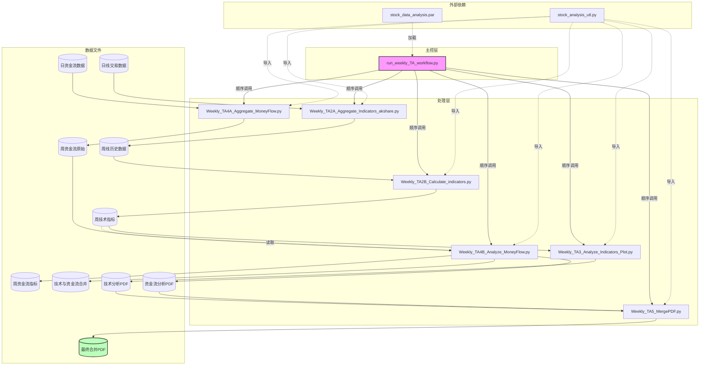
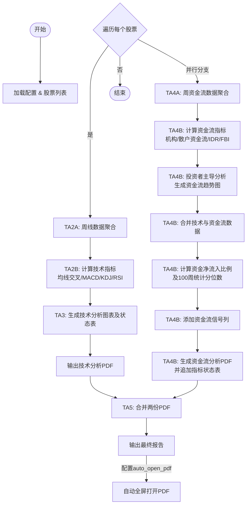

# 港股周线技术分析报告子系统技术文档

## 1. 项目概述

港股周线技术分析报告子系统是 `TA_Workflow` 项目的一部分，专为港股（香港交易所上市股票）设计，自动化生成每周技术分析与资金流综合报告。系统从日线交易数据和日线资金流数据出发，依次执行数据聚合、技术指标计算、图表绘制、资金流分析以及报告合并，最终为每只股票输出一份包含技术面与资金面分析的完整 PDF 报告。

**主要特性**：
- 全自动化流程，支持批量处理多只股票。
- 输出周线 K 线图、成交量、MACD、RSI、技术指标状态表、资金流趋势、机构/散户资金流对比、资金流指标状态等丰富内容。
- 基于日期自动确定分析区间（默认取最近 3 年或数据最早日期），无需手动干预。
- 支持通过配置文件灵活管理股票列表、路径及运行参数。

---

## 2. 系统架构

### 2.1 目录结构

```
TA_Workflow/                       # 项目根目录
├── Code_utl/                      # 工具脚本（如源代码收集）
├── Config/                        # 配置文件目录
│   └── stock_data_analysis.par    # 主配置文件（股票列表、路径等）
├── Core/                          # 核心处理脚本
│   ├── Weekly_TA2A_Aggregate_Indicators_akshare.py
│   ├── Weekly_TA2B_Calculate_indicators.py
│   ├── Weekly_TA3_Analyze_Indicators_Plot.py
│   ├── Weekly_TA4A_Aggregate_MoneyFlow.py
│   ├── Weekly_TA4B_Analyze_MoneyFlow.py
│   └── Weekly_TA5_MergePDF.py
├── Data/                          # 数据存储目录
│   ├── {ticker}_daily_historical_data.csv       # 日线交易数据
│   ├── {ticker}_weekly_historical_data.csv      # 聚合后的周线数据
│   ├── {ticker}_weekly_TA_indicators.csv        # 周技术指标
│   ├── {ticker}_daily_moneyflow.csv             # 日资金流数据
│   ├── {ticker}_weekly_moneyflow.csv            # 周资金流数据
│   ├── {ticker}_weekly_moneyflow_analysis.csv   # 周资金流指标
│   ├── {ticker}_weekly_ta_mf_analysis.csv       # 技术与资金流合并指标
│   └── dynamic_params.csv                       # 流通股本等动态参数（可选）
├── Report/                        # 输出报告目录
│   ├── {ticker}_weekly_TA_analysis.pdf          # 技术分析报告
│   ├── {ticker}_weekly_moneyflow_analysis.pdf   # 资金流分析报告
│   └── {ticker}_weekly_analysis_report.pdf      # 最终合并报告
├── Temp/                          # 临时文件目录
├── utl/                           # 公共工具模块（需自行实现）
│   └── stock_analysis_utl.py      # 提供配置加载、路径管理、日期验证等
├── log/                           # 运行日志目录
└── run_weekly_TA_workflow.py      # 主控脚本（入口）
```

### 2.2 模块依赖关系

系统分为 **主控层** 和 **处理层**：

- **主控层**：`run_weekly_TA_workflow.py` 按顺序调用 `Core` 下的六个处理脚本，并管理日志。
- **处理层**：六个脚本各自承担独立任务，数据流转如下：

```
日线数据 (daily_historical)
    ↓
[TA2A] 周线聚合 → 周线历史数据 (weekly_historical)
    ↓
[TA2B] 计算技术指标 → 周技术指标 (weekly_TA_indicators)
    ↓
[TA3] 生成图表与状态表 → 技术分析PDF (weekly_TA_analysis.pdf)

日资金流数据 (daily_moneyflow)
    ↓
[TA4A] 周资金流聚合 → 周资金流数据 (weekly_moneyflow)
    ↓
[TA4B] 计算资金流指标 + 分析 + 合并 → 资金流分析PDF (weekly_moneyflow_analysis.pdf)
                                                ↓
                                             合并文件 (weekly_ta_mf_analysis.csv)

[TA5] 合并两份PDF → 最终报告 (weekly_analysis_report.pdf)
```

所有脚本共享一个公共工具库 `stock_analysis_utl.py`，负责加载配置、管理全局路径、处理编码等。

已根据您的要求，在《港股周线技术分析报告子系统技术文档》的 **2.2 模块依赖关系** 与 **2.3 工作流程** 小节中分别添加了结构图和流程图（使用 Mermaid 格式）。您可将以下内容直接替换文档中对应的两个小节，或将其中的图表部分复制到原位置。

---

### 2.2 模块依赖关系（结构图）

系统整体分为 **主控层** 和 **处理层**，各处理脚本之间通过文件数据传递松散耦合。下图为静态模块结构及主要数据流：



**说明**：
- 主控脚本按固定顺序执行各处理脚本，前一个脚本的输出文件即为后一个脚本的输入（除 TA4B 还需读取技术指标文件外）。
- 所有脚本共享 `stock_analysis_utl.py` 工具库，用于加载配置、管理全局路径和设置编码环境。
- 最终报告 `weekly_analysis_report.pdf` 由 TA5 合并技术分析与资金流分析两份 PDF 而成。

---

### 2.3 工作流程（流程图）

系统以**股票代码**为单位，串行执行以下数据处理流程。下图展示了从原始日线数据到最终报告生成的全过程：



**流程说明**：
1. **配置加载**：从 `Config/stock_data_analysis.par` 读取股票列表及路径参数。
2. **分支处理**（技术分析分支与资金流分支并行，但实际运行顺序由主控脚本串行执行，图中以并行表示逻辑独立性）：
   - 技术分支：日线交易数据 → 周线聚合 → 技术指标计算 → 技术图表及状态表 → PDF。
   - 资金流分支：日资金流数据 → 周资金流聚合 → 资金流指标计算 → 投资者主导分析 → 合并技术与资金流 → 净流入比例及统计量 → 资金流信号 → 资金流PDF（含指标状态表）。
3. **最终合并**：将技术PDF与资金流PDF合并为一份完整报告，并可根据配置自动打开。

---


## 3. 工作流程

### 3.1 数据准备

运行前，需确保以下数据文件已存在：
- 日线交易数据：`Data/{ticker}_daily_historical_data.csv`，包含 `Date, Open, High, Low, Close, Volume, Amount, Turnover_Rate` 等列。
- 日资金流数据：`Data/{ticker}_daily_moneyflow.csv`，包含 `Date, Price_Chg%, Capital_Trend, Extra_Large, Large, Medium, Small` 等列（具体格式需与 `TA4A` 匹配）。
- 配置文件：`Config/stock_data_analysis.par`，其中必须指定 `tickers` 列表，并可指定 `auto_open_pdf` 等参数。

可选文件：`Data/dynamic_params.csv` 包含 `ticker, shares_outstanding` 字段，用于计算机构资金净流入占流通市值比例。

### 3.2 处理步骤

主控脚本依次执行以下步骤（对每个股票重复）：

1. **周线数据聚合**（TA2A）  
   读取日线交易数据，按周（以周五为结束日）聚合为 `Open, High, Low, Close, Volume, Amount, Turnover_Rate`，并计算周振幅、周涨跌幅、EMA（5,10,20,50,100,200）及 MACD，输出 `{ticker}_weekly_historical_data.csv`。

2. **技术指标计算**（TA2B）  
   读取周线历史数据，计算均线交叉（EMA5/10, EMA5/20, EMA10/50, EMA20/50）、MACD 金叉/死叉、KDJ、RSI14、黄金/死亡三角形、高质量金叉信号、成交量比率等，输出 `{ticker}_weekly_TA_indicators.csv`。

3. **技术分析图表生成**（TA3）  
   读取周技术指标 CSV，绘制包含 K 线图、成交量、MACD 柱状图、RSI14 的复合图表（第一页），以及技术指标状态表格（第二页），输出 `{ticker}_weekly_TA_analysis.pdf`。图表日期范围自动取最近 3 年（或数据最早日期）至最新交易日。

4. **周资金流数据聚合**（TA4A）  
   读取日资金流数据，按周聚合资金流数据（价格变动百分比复乘、各类型资金净额累加），输出 `{ticker}_weekly_moneyflow.csv`。

5. **资金流指标计算与分析**（TA4B）  
   该脚本功能较多，主要执行：
   - 计算机构资金流（特大单+大单）与散户资金流（中单+小单），以及 5 周移动平均、IDR、FBI 等。
   - 生成资金流趋势图、5 周均线图、不同周期（5/10/20/60/AP）的分组堆叠柱状图，产出 `{ticker}_weekly_moneyflow_analysis.pdf`。
   - 将技术指标 CSV 与资金流指标 CSV 按 `Date` 列左连接，生成 `{ticker}_weekly_ta_mf_analysis.csv`。
   - 计算资金净流入比例（如 `ExtraLarge_Ratio`, `Large_Ratio` 等），并添加过去 100 周的统计分位数。
   - 添加各类信号列（如 3 周机构连续流入/流出、多类别资金同向、机构大量吸筹等）。
   - 调用 `display_money_flow_indicators` 将资金流指标状态表追加到已有的 PDF 中（在原 PDF 末尾新增一页）。

6. **报告合并**（TA5）  
   将 `{ticker}_weekly_TA_analysis.pdf` 与 `{ticker}_weekly_moneyflow_analysis.pdf` 合并为一个 PDF 文件，保存为 `{ticker}_weekly_analysis_report.pdf`。若配置 `auto_open_pdf=true`，则自动以全屏模式打开。

---

## 4. 详细模块说明

### 4.1 主控程序 `run_weekly_TA_workflow.py`

- **功能**：调度所有子脚本，管理日志，接收命令行参数。
- **关键参数**：`--date YYYY-MM-DD`（可选），通过环境变量 `WORKFLOW_DATE` 传递给子脚本（当前子脚本未使用）。
- **日志**：控制台与 `log/run_weekly_workflow.log` 同时输出，子脚本的各自输出重定向至 `log/{script_name}.log`。
- **执行顺序**：固定为 `SCRIPT_LIST` 中定义的顺序。

### 4.2 `Weekly_TA2A_Aggregate_Indicators_akshare.py`

- **输入**：`{ticker}_daily_historical_data.csv`
- **输出**：`{ticker}_weekly_historical_data.csv`
- **主要处理**：
  - 使用 `resample('W-FRI')` 将日线聚合为周线，取周五为周结束日。
  - 计算振幅、涨跌幅（以收盘价变化率）、EMA（5/10/20/50/100/200）、MACD（DIF, Signal, Histogram）。
  - 输出 CSV 保留 4 位小数。
- **关键函数**：`aggregate_weekly_data(daily_csv_path, weekly_csv_path)`

### 4.3 `Weekly_TA2B_Calculate_indicators.py`

- **输入**：`{ticker}_weekly_historical_data.csv`
- **输出**：`{ticker}_weekly_TA_indicators.csv`
- **主要处理**：
  - 计算均线交叉状态（金叉/死叉/延续）及持续周数。
  - 判断 `Golden_Triangle`（EMA5>EMA10>EMA20）和 `Death_Triangle`（EMA5<EMA10<EMA20）。
  - 计算 KDJ（9,3,3）和 RSI14（Wilder's Smoothing）。
  - 计算成交量比率 `Volume_Ratio = Volume / VOL_EMA5`。
  - 添加 `High_Quality_Golden` 信号（基于零轴上方金叉次数等逻辑）。
- **关键函数**：`analyze_weekly_data(input_weekly_csv, output_analyzed_csv)`

### 4.4 `Weekly_TA3_Analyze_Indicators_Plot.py`

- **输入**：`{ticker}_weekly_TA_indicators.csv`
- **输出**：`{ticker}_weekly_TA_analysis.pdf`（两页）
- **主要处理**：
  - 第一页：绘制 K 线图（含 EMA10/50）、成交量柱状图（含 VOL_EMA5）、MACD 柱状图及 DIF/DEA 线、RSI14（含超买/超卖区域）。
  - 第二页：以表格形式展示最新一周的技术指标状态，包括：
    - 各均线交叉（EMA5/10, EMA5/20, EMA10/50, EMA20/50）及持续周数。
    - 确认突破/跌破 EMA20/EMA200（最近 10 周连续 3 周突破/跌破）。
    - 黄金/死亡三角形出现情况。
    - 短线/长线多头/空头排列。
    - EMA20 附近阳线/阴线统计、跳空高开/低开、KDJ 金叉/死叉、MACD 状态、成交量比率、RSI14 数值。
    - EMA5 趋势分类（上行、下行、横摆、蓄势待发、弱势横摆、拐点向上/向下）。
    - 各 EMA 值及与收盘价的比较（高亮绿色/红色）。
  - 表格行背景色根据状态自动着色（金叉绿色、死叉红色等）。
- **关键函数**：`plot_weekly_chart(csv_file, output_pdf, start_date=None, end_date=None)`

### 4.5 `Weekly_TA4A_Aggregate_MoneyFlow.py`

- **输入**：`{ticker}_daily_moneyflow.csv`
- **输出**：`{ticker}_weekly_moneyflow.csv`
- **主要处理**：
  - 按周聚合资金流数据，以周一为起始、周日（实际为周五）为结束（取该周最大日期作为 `Date`）。
  - 价格变动 `Price_Chg%` 采用复乘（`prod(1+price_chg)-1`）。
  - 其余资金流字段（`Capital_Trend`, `Extra_Large`, `Large`, `Medium`, `Small`）简单累加。
- **关键函数**：`aggregate_weekly_money_flow(input_file, output_file)`

### 4.6 `Weekly_TA4B_Analyze_MoneyFlow.py`

> 此脚本内容较多，涵盖资金流指标计算、分析、合并、报告生成等多个子任务。

- **输入**：
  - `{ticker}_weekly_moneyflow.csv`
  - `{ticker}_weekly_TA_indicators.csv`（用于合并）
- **输出**：
  - `{ticker}_weekly_moneyflow_analysis.csv`（资金流指标）
  - `{ticker}_weekly_ta_mf_analysis.csv`（合并后的完整指标）
  - `{ticker}_weekly_moneyflow_analysis.pdf`（资金流分析报告，包含后续追加的指标状态页）
- **主要功能分解**：

  - **`calculate_money_flow_indicator(input_file, output_file)`**  
    计算基础资金流指标：
    - 机构资金流 = `Extra_Large + Large`
    - 散户资金流 = `Medium + Small`
    - 5 周移动平均（`Inst_5MA`, `Ind_5MA`）
    - `IDR = abs(Institutional_Flow) / (abs(Inst)+abs(Ind))`
    - `FBI = (Inst - Ind) / (abs(Inst)+abs(Ind))`
    结果写入 `weekly_moneyflow_analysis.csv`。

  - **`analyze_investor_dominance(input_file, pdf_report, start_date, end_date)`**  
    生成投资者主导分析报告：
    - 自动确定分析期间：基于当前日期，若今日为周五则截止今日，否则截止上周五；再从数据中查找实际存在的最近交易日作为结束日期，起始日期为结束日期往前推 3 年（或数据最早日期）。
    - 绘制资金流趋势图、5 周 MA 图、分组堆叠柱状图（对比机构/散户资金构成）。
    - 输出统计文本（T 检验、主导周数、IDR/FBI 均值等）及图表，生成 PDF。

  - **`join_csv_files(file_a, file_b, file_c)`**  
    将技术指标 CSV（`weekly_TA_indicators`）与资金流分析 CSV（`weekly_moneyflow_analysis`）按 `Date` 左连接，保存为 `weekly_ta_mf_analysis.csv`。

  - **`calculate_tamf_indicators(file_tamf)`**  
    在合并后的 CSV 中追加资金净流入比例列（`ExtraLarge_Ratio`, `Large_Ratio`, `Medium_Ratio`, `Small_Ratio`, `Institutional_Net_Ratio`, `Individual_Net_Ratio`），并计算过去 100 周的各列统计分位数（最小值、最大值、10%/25%/50%/75%/90% 分位）。同时添加多种信号列（如 3 周机构连续流入、多类别同向流入等）。

  - **`display_money_flow_indicators(input_file, output_file, data_dir, start_date, end_date)`**  
    读取合并后的 CSV（已包含完整指标），在已有的资金流分析 PDF 末尾追加一页“资金流指标状态”表格。表格内容包括：
    - 散户/机构主导的阴阳线出现次数（近 10 周）。
    - 机构连续 3 周净流入/流出次数。
    - 多种资金同向流入/流出。
    - 机构大量吸筹、抛售、极端吸筹等信号。
    - 股价与机构资金顶背离/底背离。
    - 机构抛售游资买进风险信号。
    - **新增**：机构资金净流入占流通市值比例（IMFR5/10/20）及状态判定（机构加速吸筹、机构离场等）。
    - **新增**：散户情绪强度（基于散户净买入/成交额 Z 得分）和综合散户情绪指数 RSIw（基于 Z 得分加权）。
    所有条目均附带背景色提示（绿色利好，红色利空，黄色警告）。

- **关键辅助函数**：
  - `get_unit_and_scale`：根据数据量级自动选择单位（百万或十亿）。
  - `parse_shares_outstanding`：解析 `dynamic_params.csv` 中的股本字符串（亿股/万股）。
  - `determine_institutional_status`：根据三个窗口的机构净流入占比判断状态。

### 4.7 `Weekly_TA5_MergePDF.py`

- **输入**：
  - `{ticker}_weekly_TA_analysis.pdf`
  - `{ticker}_weekly_moneyflow_analysis.pdf`
- **输出**：`{ticker}_weekly_analysis_report.pdf`
- **功能**：使用 `PyPDF2.PdfMerger` 按顺序合并两个 PDF，生成最终报告。若配置 `auto_open_pdf=true`，则根据操作系统尝试全屏打开（支持 Windows/macOS/Linux）。
- **额外**：该脚本也包含生成 `Weekly_TA_MF_Indicator_Cols.txt` 的代码，列出合并后 CSV 的所有列名，方便查阅。

---

## 5. 配置文件说明

配置文件 `Config/stock_data_analysis.par` 为 Python 字典格式（可通过 `ast.literal_eval` 或 `json` 加载，实际代码使用 `load_config` 函数）。主要字段：

```python
{
    "tickers": ["00700", "00941", "09988"],   # 股票代码列表
    "data_dir": "Data",                       # 数据目录（相对路径）
    "report_dir": "Report",                   # 报告目录
    "log_dir": "log",                         # 日志目录
    "temp_dir": "Temp",                       # 临时文件目录
    "auto_open_pdf": True,                    # 是否自动打开最终报告
    # 其他自定义字段...
}
```

`stock_analysis_utl.GlobalConfig` 类负责根据配置和项目根目录解析绝对路径，各脚本通过 `GlobalConfig.full_data_dir` 等属性获取实际路径。

---

## 6. 使用方法

### 6.1 环境准备

- Python 3.8+，安装所需依赖（参考第 8 节）。
- 确保 `utl/stock_analysis_utl.py` 存在，并提供 `load_config`, `setup_windows_encoding`, `GlobalConfig`, `get_validated_dates_by_week` 等函数。
- 准备日线交易数据和日资金流数据，按命名规范放入 `Data` 目录。
- 编辑 `Config/stock_data_analysis.par`，填写待分析的股票代码。

### 6.2 运行主控程序

在项目根目录下执行：

```bash
python run_weekly_TA_workflow.py
```

可选参数：

```bash
python run_weekly_TA_workflow.py --date 2026-07-06
```

`--date` 会设置环境变量 `WORKFLOW_DATE`，但当前各子脚本并未使用，如需扩展可自行添加。

### 6.3 查看结果

最终报告位于 `Report/{ticker}_weekly_analysis_report.pdf`。若配置 `auto_open_pdf=true`，程序将自动全屏打开。

---

## 7. 输出文件说明

| 文件                                            | 说明                                                         |
| ----------------------------------------------- | ------------------------------------------------------------ |
| `Data/{ticker}_weekly_historical_data.csv`      | 周线 OHLCV 及基础指标（EMA、MACD）                           |
| `Data/{ticker}_weekly_TA_indicators.csv`        | 包含所有技术分析指标及信号列                                 |
| `Report/{ticker}_weekly_TA_analysis.pdf`        | 技术分析图表 + 状态表                                        |
| `Data/{ticker}_weekly_moneyflow.csv`            | 周资金流原始数据                                             |
| `Data/{ticker}_weekly_moneyflow_analysis.csv`   | 资金流派生指标（机构/散户资金流、IDR、FBI 等）               |
| `Data/{ticker}_weekly_ta_mf_analysis.csv`       | 技术与资金流合并后的完整数据集（含净流入比例、分位数、信号等） |
| `Report/{ticker}_weekly_moneyflow_analysis.pdf` | 资金流趋势图表 + 指标状态表                                  |
| `Report/{ticker}_weekly_analysis_report.pdf`    | **最终合并报告**（推荐查看）                                 |
| `log/run_weekly_workflow.log`                   | 主控程序运行日志                                             |
| `log/{script_name}.log`                         | 各子脚本的独立日志                                           |

---

## 8. 技术依赖

核心 Python 库列表（基于代码推断）：

- **数据处理**：`pandas`, `numpy`, `scipy`
- **绘图**：`matplotlib`, `mplfinance`, `seaborn`
- **PDF 操作**：`PyPDF2`, `fpdf`
- **系统交互**：`psutil`, `pywin32`（Windows 下用于 COM 交互）
- **其他**：`openpyxl`（虽未直接使用，但被导入）

可通过以下命令安装：

```bash
pip install pandas numpy scipy matplotlib mplfinance seaborn PyPDF2 fpdf psutil pywin32 openpyxl 
```

注意：`mplfinance.original_flavor` 在较新版本中可能被移除，建议使用 `mplfinance` 的现代接口，但当前代码仍使用旧版 `candlestick_ohlc`，可能需要安装 `mplfinance` 并确保兼容性。

---

## 9. 注意事项

1. **日期处理**：所有日期均按 `YYYY-MM-DD` 格式处理，聚合时以周五为周结束日，兼容港股交易日历（但未考虑假期停牌，若某周无数据则重采样会缺失）。
2. **资金流数据**：日资金流数据需包含 `Extra_Large`（特大单）、`Large`（大单）、`Medium`（中单）、`Small`（小单）等字段，单位需一致（金额或净额）。
3. **流通股本**：若需计算机构资金净流入占比，需在 `Data/dynamic_params.csv` 中提供 `shares_outstanding` 列，格式如 `"12.5亿股"` 或 `"1250000000"`。
4. **编码**：所有 CSV 输出均使用 `utf-8-sig` 编码，确保 Excel 正确显示中文。
5. **自定义工具模块**：`stock_analysis_utl` 未提供源码，需自行实现或根据项目现有工具调整。关键函数签名：
   - `load_config(config_path, project_dir)` → 返回配置字典。
   - `setup_windows_encoding()` → 设置控制台编码。
   - `GlobalConfig.update_paths(config, project_dir)` → 根据配置计算绝对路径并赋值给类属性。
   - `get_validated_dates_by_week(config, project_dir)` → 返回 `(start_date, end_date)`（但在 TA3 和 TA4B 中未使用，实际通过内部逻辑自动确定）。
6. **性能**：处理多只股票时，图表绘制和 PDF 生成可能耗时，建议根据需求选择性处理。
7. **错误处理**：各脚本均有异常捕获，主控脚本会在子脚本失败时终止并记录日志。

---

## 10. 未来扩展建议

- 支持增量更新，仅处理新数据而不重新计算全部历史。
- 将硬编码的窗口参数（如 3 年、100 周、10 周等）移至配置文件，提高灵活性。
- 增加对指数或 ETF 的支持。
- 优化图表样式，加入更多技术指标（如布林带、ATR 等）。
- 将资金流分析中的信号逻辑模块化，便于测试和调整。

---

*文档版本：1.0*  
*最后更新：2026-07-06*