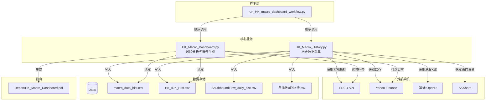
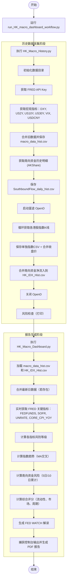

# 港股宏观分析摘要报告技术文档

## 1. 引言
港股宏观分析摘要报告是 `TA_Workflow` 项目中的一个子系统，旨在自动采集港股及全球宏观数据，进行风险监控，并生成包含指示灯和综合评分的 PDF 报告。该系统基于 Python 实现，集成了 FRED、Yahoo Finance、富途 API 和 AKShare 等多个数据源，支持历史数据更新与实时风险分析。

## 2. 系统架构

### 2.1 目录结构
项目根目录 `TA_Workflow/` 包含以下关键目录及文件：
- **Core/** – 核心业务脚本
  - `HK_Macro_History.py` – 历史数据采集与存储
  - `HK_Macro_Dashboard.py` – 仪表板与报告生成
- **Data/** – 存放所有历史数据 CSV 文件
- **Config/** – 配置文件（如 `stock_data_analysis.par`）
- **Report/** – 生成的 PDF 报告输出目录
- **Temp/** – 临时文件（可选）
- **Doc/** – 文档目录
- **.venv/** – Python 虚拟环境

根目录下的控制脚本：
- `run_HK_macro_dashboard_workflow.py` – 按顺序执行 `HK_Macro_History.py` 和 `HK_Macro_Dashboard.py`

### 2.2 工作流
系统工作流分为两个阶段：
1. **数据更新阶段**（`HK_Macro_History.py`）：获取过去10年的历史数据并追加到 CSV 文件。
2. **报告生成阶段**（`HK_Macro_Dashboard.py`）：加载历史数据，获取最新实时数据（补全缺失值），计算风险指标，生成 PDF 报告。

控制脚本 `run_HK_macro_dashboard_workflow.py` 通过子进程顺序调用上述两个脚本，确保数据最新。

### 2.3. 子系统框架图（组件与数据流）



**框架说明**：

- **控制层**：统一入口脚本，按顺序执行历史采集和报告生成。
- **核心业务**：`HK_Macro_History.py` 负责拉取并存储所有历史数据；`HK_Macro_Dashboard.py` 负责加载数据、计算风险并输出报告。
- **外部数据源**：FRED、Yahoo、富途 OpenD、AKShare。
- **数据存储**：多个 CSV 文件存放不同维度的历史数据。
- **输出**：最终生成 PDF 报告。

---

### 2.4 工作流程图（执行顺序）




**流程说明**：
1. 控制脚本按顺序调用两个核心模块。
2. 历史采集阶段：从多个数据源拉取过去 10 年数据，写入 CSV 文件。
3. 报告生成阶段：加载历史数据，实时补充最新 FRED 指标，计算风险评分，最终输出 PDF。

## 3. 核心模块

### 3.1 历史数据模块 (`HK_Macro_History.py`)

#### 功能
- 从 FRED API 获取美国国债收益率（2Y、10Y、30Y）、VIX、美元兑人民币汇率（USDCNY）等宏观指标。
- 从 Yahoo Finance 获取 DXY 美元指数。
- 从富途 API 获取港股主要指数（恒生指数、国企指数、科技指数、金融/地产/工商/公用事业分类指数、生物科技指数、波幅指数 VHSI）的日线 K 线数据，并保存为单独 CSV，同时提取收盘价合并到统一文件。
- 通过 AKShare 获取南向资金（沪深港通）日度净流入明细。

#### 数据源
| 数据项                          | 数据源                                         | 实现函数/方式                   |
| ------------------------------- | ---------------------------------------------- | ------------------------------- |
| DXY                             | Yahoo Finance (`DX-Y.NYB`)                     | `get_historical_data()`         |
| US2Y, US10Y, US30Y, VIX, USDCNY | FRED API (DGS2, DGS10, DGS30, VIXCLS, DEXCHUS) | `fred.get_series()`             |
| 港股指数 (恒生、国企等)         | 富途 API (`moomoo`)                            | `get_index_kline()` 分页请求    |
| 南向资金净流入                  | AKShare (`stock_hsgt_hist_em`)                 | `get_southbound_flow_history()` |

#### 输出文件
- `macro_data_hist.csv` – 宏观指标历史数据
- `HK_IDX_Hist.csv` – 港股指数收盘价合并 + 南向资金净流入
- `SouthboundFlow_daily_hist.csv` – 南向资金每日明细（买入/卖出/净流入）
- 各指数单独 K 线文件（如 `HK_IDX_HSI.csv`）

### 3.2 仪表板与报告模块 (`HK_Macro_Dashboard.py`)

#### 功能
- 加载 `macro_data_hist.csv` 和 `HK_IDX_Hist.csv`（若存在），并可选地实时获取最新 FRED 指标补齐数据。
- 计算各指标的风险等级（低/中/高/极高），基于阈值和移动平均趋势。
- 生成综合评分（流动性、市场、周期三个维度）。
- 输出 PDF 报告（包含彩色指示灯、阈值参考表、当前状态、FED WATCH 解读等）。

#### 数据源（实时/补充）
- 实时调用 FRED API 获取最新 FEDFUNDS、SOFR、UNRATE、CORE_CPI_YOY。
- 使用 Yahoo Finance 获取 VIX、USDCNY 等最新值（可选）。
- VHSI 直接从历史文件读取，不实时获取。

#### 输出
- PDF 报告 `HK_Macro_Dashboard.pdf`（位于 `Report/` 目录）。

## 4. 数据流程

### 4.1 数据采集流程（`HK_Macro_History.py`）
```
[开始] 
  → 确定数据目录 (Data/)
  → 获取 FRED API Key (从 Config/stock_data_analysis.par 或环境变量)
  → 循环获取宏观指标 (DXY, US2Y, US10Y, US30Y, VIX, USDCNY)
  → 合并旧数据并保存 macro_data_hist.csv
  → 获取南向资金历史明细 (AKShare) 并保存 SouthboundFlow_daily_hist.csv
  → 启动富途 OpenD 进程
  → 循环获取各港股指数 K 线 (分页请求)
  → 保存单独 CSV 并提取收盘价合并
  → 合并南向资金净流入到 HK_IDX_Hist.csv
  → 关闭 OpenD
  → 执行简单风险检查 (打印)
[结束]
```

### 4.2 风险分析与报告流程（`HK_Macro_Dashboard.py`）
```
[开始]
  → 加载 macro_data_hist.csv 和 HK_IDX_Hist.csv
  → 若存在最新的 daily CSV (macro_data.csv, hk_idx.csv) 则合并去重
  → 实时获取 FRED 关键指标 (FEDFUNDS, SOFR, UNRATE, CORE_CPI_YOY)
  → 计算各指标风险等级 (基于阈值)
  → 计算指数趋势 (MA 交叉)
  → 计算南向资金风险 (5日/10日累计净流入)
  → 计算综合评分 (流动性、市场、周期)
  → 生成 FED WATCH 解读
  → 将控制台输出捕获并生成 PDF (使用 ReportLab)
[结束]
```

## 5. 数据存储说明

### 5.1 宏观历史数据 (`macro_data_hist.csv`)
| 字段         | 类型  | 说明                     |
| ------------ | ----- | ------------------------ |
| date         | date  | 日期                     |
| DXY          | float | 美元指数                 |
| US2Y         | float | 美国2年期国债收益率 (%)  |
| US10Y        | float | 美国10年期国债收益率 (%) |
| US30Y        | float | 美国30年期国债收益率 (%) |
| VIX          | float | 波动率指数               |
| USDCNY       | float | 美元兑人民币汇率         |
| FEDFUNDS     | float | 联邦基金利率 (%)         |
| SOFR         | float | 隔夜担保融资利率 (%)     |
| UNRATE       | float | 失业率 (%)               |
| CORE_CPI_YOY | float | 核心CPI同比 (%)          |

### 5.2 港股历史数据 (`HK_IDX_Hist.csv`)
| 字段           | 类型  | 说明                  |
| -------------- | ----- | --------------------- |
| date           | date  | 日期                  |
| HSI            | float | 恒生指数收盘价        |
| HSCEI          | float | 恒生国企指数收盘价    |
| HSTECH         | float | 恒生科技指数收盘价    |
| HSNF           | float | 恒生金融分类指数      |
| HSNP           | float | 恒生地产分类指数      |
| HSNC           | float | 恒生工商分类指数      |
| HSNU           | float | 恒生公用事业分类指数  |
| HSBIO          | float | 恒生生物科技指数      |
| VHSI           | float | 恒指波幅指数          |
| SouthboundFlow | float | 南向资金净流入 (亿元) |

### 5.3 南向资金明细 (`SouthboundFlow_daily_hist.csv`)
| 字段        | 类型  | 说明                        |
| ----------- | ----- | --------------------------- |
| date        | date  | 日期                        |
| buy_amount  | float | 买入成交额 (亿元)           |
| sell_amount | float | 卖出成交额 (亿元)           |
| net_inflow  | float | 净流入 = 买入 - 卖出 (亿元) |

## 6. 配置说明

### 6.1 配置文件位置
`Config/stock_data_analysis.par`（文本格式，键值对）

### 6.2 必需配置项
```ini
[FREDAPI]
FRED_API_KEY = your_fred_api_key_here

# 富途 OpenD 配置
futu_account = 你的富途账号
futu_pwd_md5 = 密码的 MD5 值
opend_exec_path = C:/path/to/OpenD.exe   # Windows 可执行文件路径
api_host = 127.0.0.1
api_port = 11111
```

若未在配置文件中提供，系统会尝试从环境变量 `FRED_API_KEY` 获取。

## 7. 部署与运行

### 7.1 环境要求
- Python 3.8+
- 依赖库：`pandas`, `numpy`, `yfinance`, `akshare`, `fredapi`, `moomoo`, `reportlab`, `pdfplumber`, `requests`, `configparser`
- 富途 OpenD 客户端（需提前安装并配置好账户）

### 7.2 安装依赖
```bash
pip install pandas numpy yfinance akshare fredapi moomoo reportlab pdfplumber requests configparser
```

### 7.3 运行方式
在项目根目录下执行：
```bash
python run_HK_macro_dashboard_workflow.py
```
该脚本会依次执行历史数据采集和报告生成。也可单独运行：
```bash
python Core/HK_Macro_History.py   # 仅更新历史数据
python Core/HK_Macro_Dashboard.py # 仅生成报告（基于已有数据）
```

### 7.4 输出位置
- CSV 数据文件：`Data/` 目录
- PDF 报告：`Report/HK_Macro_Dashboard.pdf`

## 8. 风险指标详解

### 8.1 各指标风险阈值

| 指标                          | 低风险 | 中风险            | 高风险             | 极高风险 |
| ----------------------------- | ------ | ----------------- | ------------------ | -------- |
| DXY                           | < 103  | 103~106           | > 106              | –        |
| US2Y                          | < 3.8% | 3.8%~4.2%         | > 4.2%             | –        |
| US10Y                         | < 4.6% | 4.6%~5.0%         | > 5.0%             | –        |
| US30Y                         | < 4.8% | 4.8%~5.0%         | 5.0%~5.5%          | > 5.5%   |
| USDCNY                        | < 7.25 | 7.25~7.40         | > 7.40             | –        |
| VIX                           | ≤ 25   | 25~35             | 35~50              | > 50     |
| VHSI                          | < 20   | 20~30             | 30~40              | > 40     |
| 南向资金                      | –      | 5日净流出 > 100亿 | 10日净流出 > 300亿 | –        |
| 指数趋势 (HSI, HSTECH, HSCEI) | –      | 跌破 MA60         | 跌破 MA120/MA250   | –        |

### 8.2 趋势判断
- **HSI, HSTECH**：使用 MA60 和 MA120 交叉判断趋势恶化程度。
- **HSCEI**：使用 MA120 和 MA250 判断。
- **US2Y, DXY**：使用 MA20 和 MA60 判断上行/下行趋势。

### 8.3 综合评分模型
系统从三个维度计算风险分数：
- **流动性 (Liquidity)**：基于 DXY、US10Y、US30Y、USDCNY 的偏离程度，满分 8 分。
- **市场 (Market)**：基于 VIX、VHSI、南向资金、指数趋势，满分 10 分。
- **周期 (Cycle)**：基于 US2Y 绝对值、核心CPI同比、2s10s利差，满分 4 分。

总分 22 分，对应信号灯和仓位建议：
- **绿灯 (0~5)**：仓位 50-70%
- **黄灯 (6~9)**：仓位 30-50%
- **橙灯 (10~13)**：仓位 10-30%
- **红灯 (≥14)**：仓位 0-10%

## 9. 输出报告内容
PDF 报告包含以下章节：
1. **指标阈值参考表** – 各指标的风险等级划分。
2. **当前指标状态** – 各指标最新值、风险指示灯、移动平均细节。
3. **综合风险评分** – 流动性/市场/周期得分及总评分，信号灯及仓位建议。
4. **FED WATCH 宏观解读** – 政策预期、利率展望、收益率曲线形态与趋势。
5. **数据日期** – 各项指标的最新数据日期。

报告使用彩色圆形指示灯（●）表示风险等级（绿/黄/橙/红/灰）。

## 10. 注意事项与常见问题

1. **FRED API Key**：必须提前申请并配置，否则 FRED 数据无法获取。
2. **富途 OpenD**：需要启动并登录，且配置文件中路径正确；如果 OpenD 启动失败，指数数据将跳过。
3. **网络要求**：依赖外部 API，若网络不稳定可能导致部分数据缺失，系统会保留历史值。
4. **VHSI 数据**：仅从历史文件读取，若历史文件无 VHSI 列则不会显示。
5. **实时数据**：`HK_Macro_Dashboard.py` 会尝试实时获取 FRED 最新值，若失败则沿用历史最新值。
6. **PDF 中文字体**：系统会尝试注册系统字体（SimSun, SimHei, Microsoft YaHei 等），若未找到则使用 Helvetica，中文可能显示为方框。建议预先安装中文字体。
7. **增量更新**：`HK_Macro_History.py` 会合并旧文件，避免重复记录。
8. **日志输出**：控制台会打印详细步骤，便于调试。

## 11. 扩展建议
- 可将历史数据采集与报告生成分离为定时任务（如每日/每周）。
- 支持增加更多宏观指标（如 PMI、通胀预期）。
- 可扩展报告格式（如 HTML/Excel）。
- 可增加邮件自动发送报告功能。

---

*文档版本 1.0*  
*最后更新：2026-07-06*