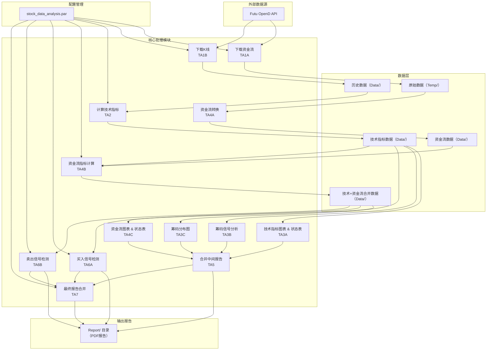
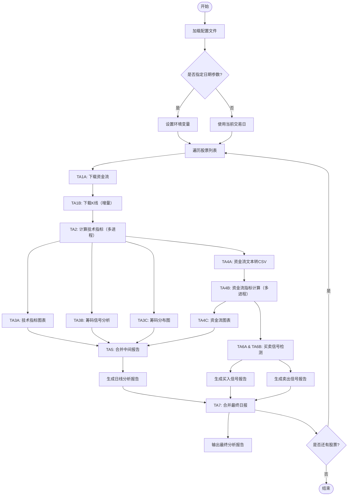

# 港股日线技术分析报告子系统技术文档

## 1. 概述

**港股日线技术分析报告子系统** 是 `TA_Workflow` 项目中的重要组成部分，旨在**自动化处理港股日线级别数据**，生成涵盖**技术指标、筹码分布、资金流、买卖信号**的综合性分析报告。系统通过 `run_daily_TA_workflow.py` 主控程序，顺序调用 `Core` 目录下的一系列 Python 脚本，完成从数据下载、指标计算、图表生成到报告合并的全流程。

该子系统面向**量化分析师、交易员**，提供标准化的日报输出，辅助投资决策。

---

## 2. 系统架构

### 2.1 目录结构
```
TA_Workflow/
├── Code_utl/                 # 工具程序（例如源码收集脚本）
├── Config/                   # 配置文件 stock_data_analysis.par
├── Core/                     # 核心功能脚本（日线流程各步骤）
├── Data/                     # 数据存储（CSV）
├── Report/                   # 最终报告输出（PDF）
├── Temp/                     # 临时文件（中间数据、缓存）
├── log/                      # 运行日志
├── run_daily_TA_workflow.py  # 主控程序
└── ... (其他工作流脚本)
```

### 2.2 数据流概览
```
[外部数据源] (Futu OpenD / 网络)
      ↓
1. 下载资金流 & 原始行情 → Temp/*.txt, Data/*.csv
      ↓
2. 计算技术指标 → Data/*_daily_technical_analysis.csv
      ↓
3. 技术指标可视化 & 筹码分析 → Report/*.pdf (中间)
      ↓
4. 资金流转换 & 指标计算 → Data/*_daily_moneyflow.csv, *daily_ta_mf_analysis.csv
      ↓
5. 资金流分析图表 → Report/*_daily_moneyflow_analysis.pdf
      ↓
6. 买卖信号检测 → Report/*_buy_signal_analysis_sum.pdf, *sell_signal_analysis_sum.pdf
      ↓
7. 合并所有报告 → Report/*_daily_analysis_report.pdf
```

### 2.3 执行顺序
主控程序 `run_daily_TA_workflow.py` 按 `SCRIPT_LIST` 顺序执行以下脚本（编号对应功能）：

| 编号 | 脚本名称                                            | 功能描述                                                     |
| ---- | --------------------------------------------------- | ------------------------------------------------------------ |
| 1    | `Daily_TA1A_download_moneyflow.py`                  | 下载个股资金流（机构/散户）及资金分布原始数据                |
| 2    | `Daily_TA1B_download_data_moomoo.py`                | 下载历史K线数据（含换手率、涨跌幅等），增量更新              |
| 3    | `Daily_TA2_Calculate_Indicators_akshare_mproc.py`   | 计算大量技术指标（EMA、MACD、RSI、KDJ、筹码集中度等）        |
| 4    | `Daily_TA3A_Analyze_Indicators_Plot.py`             | 绘制K线图、成交量、MACD、RSI，并生成技术指标状态表格         |
| 5    | `Daily_TA3B_Chip_Signal_Analysis.py`                | 筹码信号分析（底部/顶部确认、吸筹/派发等），生成信号报告     |
| 6    | `Daily_TA3C_Chip_Distribution_Analysis.py`          | 筹码分布可视化（20/60/250日区间），展示VA（70%）区间         |
| 7    | `Daily_TA4A_Convert_MoneyFlow.py`                   | 将资金流原始文本转换为CSV格式                                |
| 8    | `Daily_TA4B_Caculate_MoneyFlow_Indicator_mproc.py`  | 计算资金流指标（机构/散户净流入、IDR、FBI等），合并技术指标  |
| 9    | `Daily_TA4C_Analyze_MoneyFlow_mproc.py`             | 生成资金流可视化图表及资金流指标状态表                       |
| 10   | `Daily_TA5_MergePDF.py`                             | 合并前三份PDF（技术指标、筹码信号、筹码分布、资金流）为一份  |
| 11   | `Daily_TA6A_Buy_Signal_Analyzer_Workflow_mproc.py`  | 检测多种买入信号（金叉、背离、头肩底等），生成买入摘要与详细报告 |
| 12   | `Daily_TA6B_Sell_Signal_Analyzer_Workflow_mproc.py` | 检测多种卖出信号（头肩顶、双顶、MACD顶背离等），生成卖出摘要与详细报告 |
| 13   | `Daily_TA7_Merge_Analysis_Report_Workflow.py`       | 将日线报告、周线报告（如有）以及买卖信号报告合并为最终日报   |

## 

### 2.4 港股日线技术分析报告子系统框架图（模块关系）



---

### 2.5 港股日线技术分析报告子系统流程图（执行顺序与决策）



---

### 3. 说明

- **框架图** 展示了系统的 **分层结构**：数据源、配置、数据存储、核心处理模块、最终输出。箭头表示数据或配置的流向。
- **流程图** 以 **主控程序** 为中心，描述了 **顺序执行** 的13个步骤，以及 **多进程** 并行处理点（TA2、TA4B、TA6A/B）。最终合并生成日报。
- **关键决策点**：日期参数处理、股票循环、报告文件是否存在（TA7 中会判断买卖信号报告是否存在，缺失时生成占位页）。

此图表可作为系统设计文档的一部分，帮助开发人员和用户理解整体架构与工作流程。


## 3. 模块详细说明

### 3.1 数据下载模块 (TA1A & TA1B)

- **TA1A**：通过 `Futu OpenD` 获取**当日（或昨日）资金流数据**（特大/大/中/小单净流入）以及**资金分布原始数据**（买入/卖出额）。数据存储为 `Temp/{ticker}_moneyflow_{date}.txt` 和 `Temp/{ticker}_capdist_{date}.txt`，同时追加至累计文件 `Temp/{ticker}_moneyflow.txt` 和 `Temp/{ticker}_capdist.txt`。
- **TA1B**：通过 `Futu OpenD` 下载**历史日线数据**（包含开/高/低/收、成交量、成交额、换手率、涨跌幅、振幅等），支持增量更新。数据保存为 `Data/{ticker}_daily_historical_data.csv`，若已有文件则追加新日期数据。

> **依赖**：需要正确配置 `Futu OpenD` 路径、账号及密码（MD5）在配置文件中。

### 3.2 技术指标计算模块 (TA2)

- **输入**：`Data/{ticker}_daily_historical_data.csv`
- **输出**：`Data/{ticker}_daily_technical_analysis.csv`
- **功能**：基于原始K线计算大量技术指标，包括：
  - 均线（EMA5/10/20/50/60/100/200/250等）
  - 偏移率（BIAS）
  - 成交量均线（VOL_EMA5/10/20）、量比
  - 动量指标（RSI6/14、MACD、KDJ、CCI、Williams%R）
  - 趋势指标（ADX/PDI/MDI 14/30/60/100）
  - 布林带
  - **筹码集中度**（两种方法：价格振幅法、成本价差法，支持不同周期）
  - 密集交易区间
  - 各类交叉信号（黄金交叉、死亡交叉、三角形态）
  - 自定义信号条件（底部/顶部、吸筹/派发等）
- **优化**：采用向量化计算与多进程处理，提升效率。

### 3.3 技术指标可视化与筹码分析 (TA3A, TA3B, TA3C)

- **TA3A**：生成**技术指标图表**（K线+EMA5/20/200、成交量、MACD、RSI）和**技术指标状态表**（包含均线排列、突破/跌破、金叉死叉、集中度等）。输出为 `Report/{ticker}_daily_TA_indicator_analysis.pdf`（由两个临时PDF合并）。
- **TA3B**：专注于**筹码信号分析**，识别底部/顶部信号、吸筹/派发、多周期共振等，并输出详细信号报告。输出 `Report/{ticker}_daily_chip_signal_analysis.pdf`。
- **TA3C**：绘制**20/60/250日筹码分布图**，左侧K线图叠加均线，右侧显示筹码分布直方图，并标注POC（控制点）、VA（70%成交量区间）等。输出 `Report/{ticker}_daily_chip_distribution_analysis.pdf`。

### 3.4 资金流处理与分析 (TA4A, TA4B, TA4C)

- **TA4A**：将 `Temp/{ticker}_moneyflow.txt` 解析为结构化CSV，保存为 `Data/{ticker}_daily_moneyflow.csv`。
- **TA4B**：计算资金流相关指标（机构/散户净流入、5日均线、IDR、FBI），并与技术指标合并，生成 `Data/{ticker}_daily_ta_mf_analysis.csv`。同时计算净流入比例、500日滚动统计以及各类资金信号（多日连续流入/流出、顶底背离等）。支持多进程处理。
- **TA4C**：生成资金流分析报告，包含：
  - 机构与散户资金流趋势图（日线及5日均线）
  - 分组堆积柱状图（比较不同周期（5/10/20/60日）各类资金净额）
  - 资金流指标状态表（如机构连续流入、背离、吸筹/派发等）
  输出 `Report/{ticker}_daily_moneyflow_analysis.pdf`。

### 3.5 买卖信号检测 (TA6A, TA6B)

这两个模块分别检测**买入信号**和**卖出信号**，基于历史数据（日、周、月线）识别多种经典形态和技术背离。

- **TA6A（买入）**：支持信号包括：
  - 三线金叉（均线+MACD+成交量）
  - 月线/周线底背离（MACD/柱状线）
  - 一阳穿多线
  - 双重底/头肩底颈线放量突破
  - 圆弧底（21/63日均线）
  - 底部立桩量、空中加油、黄金分割回调、均线多头首次金叉
  - 看涨吞没、启明星、布林下轨超卖反转、KDJ/RSI超卖拐头等
- **TA6B（卖出）**：支持信号包括：
  - 头肩顶、圆弧顶、双顶、三重顶、菱形顶
  - MACD顶背离 + 均线死叉/缩量/放量破位
  - RSI顶背离 + 均线死叉/缩量/看跌K线
  - 均线死叉、空头排列、趋势线跌破

**输出**：
- 摘要报告：`Report/{ticker}_buy_signal_analysis_sum.pdf`（或 `_sell_`），包含最近3周信号的综合评分（基础分、共振分、趋势分、量能分）。
- 详细报告：`Report/{ticker}_buy_signal_analysis_details.pdf`（或 `_sell_`），列出所有检测到的信号及其详细参数。

### 3.6 报告合并 (TA5, TA7)

- **TA5**：将 TA3A、TA3B、TA3C、TA4C 生成的四个PDF合并为一个中间文件 `{ticker}_daily_analysis_report.pdf`（实际在TA5中合并）。
- **TA7**：最终汇总，将 `{ticker}_daily_analysis_report.pdf`、`{ticker}_weekly_analysis_report.pdf`（若有）、以及买卖信号摘要（若存在）合并为最终的 `{ticker}_analysis_report.pdf`。若买卖信号摘要缺失，可生成占位提示页（需安装 reportlab）。

---

## 4. 配置文件说明

配置文件位于 `Config/stock_data_analysis.par`，采用类似 INI 格式，主要配置项如下：

| 配置项                                                       | 类型       | 说明                                     |
| ------------------------------------------------------------ | ---------- | ---------------------------------------- |
| `tickers`                                                    | list       | 股票代码列表（如 `["00788","00371"]`）   |
| `start_date` / `end_date`                                    | string     | 分析起始/结束日期（格式 YYYY-MM-DD）     |
| `data_dir` / `report_dir` / `temp_dir` / `log_dir`           | string     | 各目录路径（相对或绝对）                 |
| `futu_account` / `futu_pwd_md5`                              | string     | Futu OpenD 登录账号及密码 MD5            |
| `opend_exec_path`                                            | string     | OpenD 可执行文件路径                     |
| `api_host` / `api_port`                                      | string/int | OpenD API 地址及端口                     |
| `use_multiprocessing`                                        | boolean    | 是否启用多进程（用于指标计算和信号检测） |
| `max_workers`                                                | int        | 并行进程数                               |
| `calculate_ta_indicators` / `convert_money_flow` / `auto_open_pdf` | boolean    | 控制各步骤是否执行（可选）               |

> 注意：所有路径可使用绝对路径或相对于项目根目录的相对路径。

---

## 5. 运行方式

### 5.1 命令行运行
在项目根目录执行：
```bash
python run_daily_TA_workflow.py [--date YYYY-MM-DD]
```
- `--date` 参数可选，指定分析日期（默认使用当前交易日）。该日期会通过环境变量 `WORKFLOW_DATE` 传递给各子脚本。

### 5.2 前提条件
- **Futu OpenD** 必须启动（程序会自动启动并关闭，但需配置正确路径）。
- 配置文件 `stock_data_analysis.par` 必须存在且包含必要字段。
- 确保所有依赖库已安装（见第 7 节）。

### 5.3 日志
- 主控程序日志：`log/run_daily_workflow.log`（追加模式）。
- 每个子脚本的独立日志：`log/{script_name}.log`（每次覆盖）。

---

## 6. 输出报告

最终生成的报告位于 `Report/` 目录，以股票代码命名：

| 文件名                                      | 说明                                                         |
| ------------------------------------------- | ------------------------------------------------------------ |
| `{ticker}_daily_analysis_report.pdf`        | 包含技术指标图表、筹码信号、筹码分布、资金流分析（由 TA5 生成） |
| `{ticker}_analysis_report.pdf`              | 最终日报（含买卖信号摘要，由 TA7 合并）                      |
| `{ticker}_buy_signal_analysis_sum.pdf`      | 买入信号摘要（最近3周）                                      |
| `{ticker}_buy_signal_analysis_details.pdf`  | 买入信号详细列表（整个分析期）                               |
| `{ticker}_sell_signal_analysis_sum.pdf`     | 卖出信号摘要                                                 |
| `{ticker}_sell_signal_analysis_details.pdf` | 卖出信号详细列表                                             |

所有中间文件（临时PDF）均在 `Temp/` 目录，最终报告合并后会被清理（TA7 中临时占位页会删除）。

---

## 7. 依赖与部署

### 7.1 Python 环境
- Python 3.8+（推荐 3.10）
- 主要第三方库：
  - `pandas`, `numpy`, `matplotlib`, `seaborn`
  - `mplfinance`, `PyPDF2`, `reportlab` (推荐)
  - `moomoo` (Futu OpenD API)
  - `scipy`, `openpyxl`
  - `akshare`（本系统未直接使用，但可能作为备用数据源）

- 安装方法

  pip install pandas numpy matplotlib seaborn mplfinance PyPDF2 reportlab futu-api scipy openpyxl akshare fpdf

### 7.2 Futu OpenD
需要安装并配置 Futu OpenD，确保 `opend_exec_path` 指向可执行文件，并提供有效账号。

### 7.3 部署建议
- 可将项目部署在 Windows 服务器（因 OpenD 在 Windows 上运行更稳定）。
- 建议使用 `cron` 或 `任务计划程序` 每日收盘后（如 16:30）定时执行主控脚本。

---

## 8. 故障排查与日志

- **查看主日志**：`log/run_daily_workflow.log` 显示整体执行状态。
- **子脚本日志**：每个子脚本有独立日志，便于定位具体步骤错误。
- **常见问题**：
  - OpenD 无法连接：检查配置文件中的账户、密码MD5、端口及OpenD路径。
  - 数据缺失：检查网络或 Futu 权限，确保有行情权限。
  - 内存不足：可调整 `max_workers` 降低并行度。

---

## 9. 扩展与定制

- 如需增加新的技术指标，可在 `Daily_TA2` 中添加计算函数。
- 如需增加新的买卖信号，可在 `TA6A` 或 `TA6B` 中注册新的检测函数。
- 配置文件中各步骤开关（如 `calculate_ta_indicators`）可控制是否执行，便于调试。

---

## 10. 版本与维护

- 版本历史记录于项目文档（略）。
- 建议定期更新 Futu OpenD 及 Python 库以确保兼容性。

---

> **文档生成日期**：2026-07-06  
> **基于源码**：`run_daily_TA_workflow.py` 及 `Core/` 下所有脚本（版本 v1.0）。